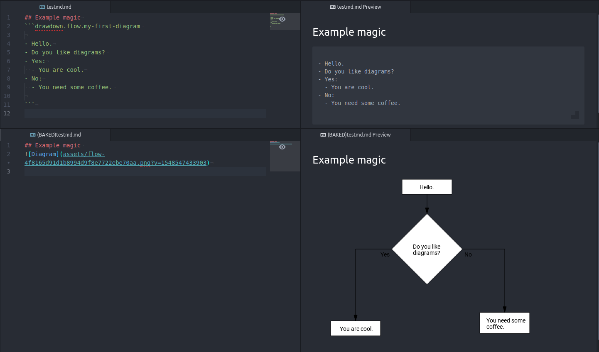

# Drawdown Bake
Drawdown bake is a tool for baking markdown documents with drawdown diagram scripts into markdown documents with diagram images


## Installation

```bash
npm install drawdown-bake --save-dev
```

## Usage
Once installed the tool can be manually run by
```bash
node node_modules/.bin/drawdown-bake ./docs ./baked
```
This will make the baker walk trough `./docs` recursively and search for _markdown_ files to bake.<br>
For every file found it will:
1. Extract all _drawdown_ scripts.
2. Create an _image representation_ of the diagram. The image will be stored into `./baked/assets`.
3. Scripts will be replaced with image references.
4. Create new _makrdown_ file into its relative directory within `./baked`.
5. All non _makrdown_-ish files will be copied as is.

### Use in projects
In a project `drawdawn-bake` can be used as a _npm script_ in the `package.json`:

```json
{
  "scripts": {
    "bake": "drawdown-bake ./src ./baked",
  },
}
```
Now, every time a new fresh documentation badge is needed it can be baked by:
```bash
npm run bake
```

## Command syntax

```bash
drawdown-bake <source-dir> <destination-dir> [options]
```
### Options

Option   |         Defaults         | Description
:--------|:------------------------:|:--------------------------
**ext**      |      _md,markdown_        | CVS file extensions for markdown files to be baked
**layout**   | _.drawdown&#8209;preview&#8209;layout_ | Path to a JSON file with drawdown layout information.
**no&#8209;layout**  | ---  | Will make the baker use automatic diagram layouts. Using `--layout` and `--no-layout` together will cause an error
**web&#8209;dir**  |    _&lt;module>/web_     | A path to the directory which holds the browser version of the baker. Internally this tool uses `puppeteer` and `chromium` to render the SVG scripts produced by the `drawdown-svg-render`
**web&#8209;port** |           _8989_           | Port number for the minimalistic web server to listen to. This server is used to serve the browser version of the baker which is later used by the `chromium` spawned by the `puppeteer`

## Examples

Bake only `.txt` and `.md` files
```bash
drawdown-bake ./docs ./baked --ext=txt,md
```
---
Bake with custom layout file
```bash
drawdown-bake ./docs ./baked --layout=my_layout.json
```
---
Bake with automatic layout
```bash
drawdown-bake ./docs ./baked --no-layout
```
---
Using different port for the built-in http-server (in case the default :8989 is already used)
```bash
drawdown-bake ./docs ./baked --web-port=8787
```
